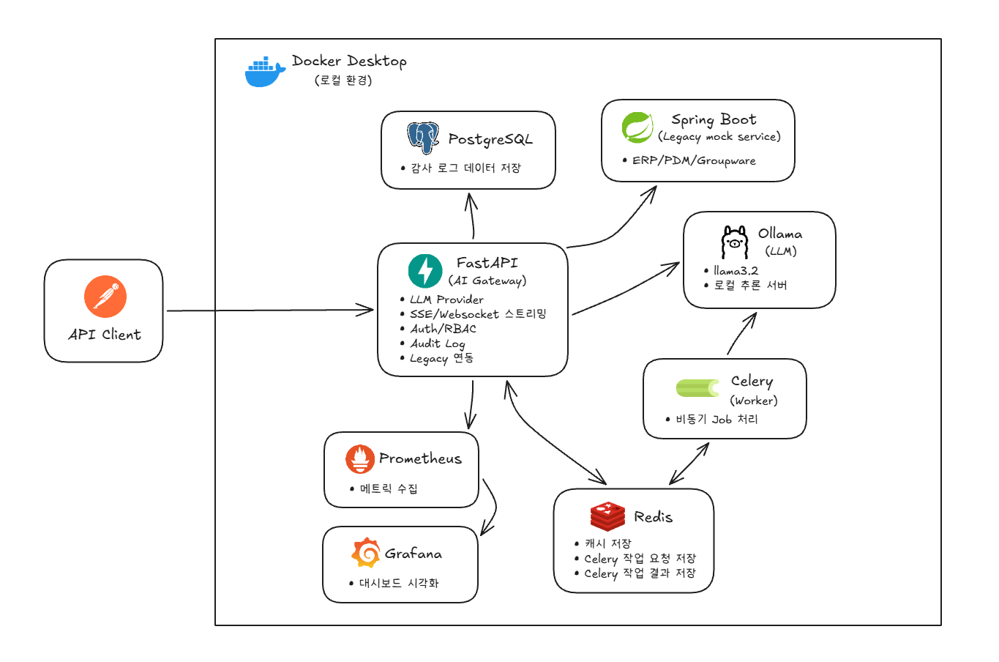

# Legacy 연동 LLM Gateway PoC

사내망/공공망/레거시 시스템 환경을 가정한 **LLM Gateway 개인 기술검증 포트폴리오**입니다. LLM 추론 서버와 레거시(ERP/PDM/Groupware) 데이터를 연결하는 게이트웨이 계층을 FastAPI 중심으로 구현했습니다.

이 프로젝트의 목적은 LLM 추론 서버 연동, FastAPI, SSE/WebSocket 스트리밍, Redis 캐싱, Celery 비동기 작업, JWT/RBAC, 감사 로그, Prometheus/Grafana 모니터링, Docker Compose 운영 구성을 실제 코드로 검증하는 것입니다.

## 시스템 아키텍처



## 핵심 요약

- FastAPI 기반 LLM Gateway API
- Ollama LLM 제공자 연동 및 추후 vLLM/OpenAI 호환 제공자로 확장 가능한 구조
- 일반 응답, SSE 스트리밍, WebSocket 스트리밍 지원
- Spring Boot 기반 `legacy-mock-service`로 Mock ERP/PDM/Groupware API 제공
- `context_sources`를 통한 레거시 mock 데이터와 프롬프트 context 합성
- Redis 기반 프롬프트/context 캐시
- Celery 기반 비동기 LLM 작업 처리
- JWT 인증, USER/ADMIN RBAC, PostgreSQL 감사 로그 저장
- Prometheus 지표 수집, Grafana 대시보드 시각화
- Docker Compose로 API, worker, Redis, PostgreSQL, Prometheus, Grafana, Legacy Mock Service 실행

## 기술 역량 매핑

| 기술 | 구현 내용 | 주요 위치 |
| --- | --- | --- |
| LLM 추론 서버 연동 | Ollama `/api/generate` 스트리밍 연동, LLM 호출부 인터페이스 분리 | `backend/app/providers/` |
| FastAPI | HTTP API, SSE, WebSocket, 미들웨어, 의존성 기반 인증 | `backend/app/api/`, `backend/app/main.py` |
| SSE 스트리밍 | `POST /api/v1/chat/stream`에서 Ollama 토큰 응답을 SSE 이벤트로 변환 | `backend/app/api/routes/chat.py` |
| WebSocket 스트리밍 | `WS /api/v1/ws/chat`에서 프롬프트별 토큰 스트림 응답 | `backend/app/api/routes/ws.py` |
| Redis 캐싱 | 프롬프트와 context 해시 기반 캐시 키 생성, 캐시 적중 시 LLM 호출 생략 | `backend/app/cache/`, `backend/app/jobs/service.py` |
| Celery 비동기 작업 | `POST /api/v1/jobs/chat`, `GET /api/v1/jobs/{job_id}` | `backend/app/jobs/`, `backend/app/tasks/` |
| 레거시 시스템 연동 | Spring Boot Mock ERP/PDM/Groupware, FastAPI LegacyContextClient | `legacy-mock-service/`, `backend/app/legacy/` |
| JWT/RBAC | 샘플 사용자 로그인, USER/ADMIN 접근 제어 | `backend/app/auth/` |
| 감사 로그 | 로그인/권한/LLM/레거시 이벤트를 PostgreSQL `audit_logs`에 저장 | `backend/app/audit/` |
| Prometheus/Grafana | HTTP/LLM/캐시/감사 로그/WebSocket 지표 수집, 대시보드 자동 구성 | `backend/app/core/metrics.py`, `monitoring/` |
| Docker Compose | API, worker, PostgreSQL, Redis, Prometheus, Grafana, 레거시 서비스 구성 | `docker-compose.yml` |
| 테스트 | pytest, 대체 객체, SQLite 테스트 DB | `backend/tests/` |

## 실행 방법

### 필수 조건

- [Docker Desktop 다운로드](https://www.docker.com/products/docker-desktop/) 후 실행 중이어야 합니다. Docker Desktop에는 Docker Compose(`docker compose`)가 포함되어 있습니다.
- 최초 실행 시 Docker 이미지와 Ollama 모델을 내려받기 위한 인터넷 연결이 필요합니다.
- Ollama `llama3.2` 모델 저장을 위한 디스크 여유 공간이 필요합니다.

### 1. 전체 서비스 실행

```bash
docker compose up --build
```

FastAPI, Celery worker, Redis, PostgreSQL, Prometheus, Grafana, Spring Boot Legacy Mock Service, Ollama가 함께 실행됩니다. 기본 로컬 실행에 필요한 설정값은 `docker-compose.yml`에 포함되어 있어 `.env` 파일 없이 실행할 수 있습니다.

### 2. Ollama 모델 준비

Ollama 모델은 최초 1회 내려받아야 합니다. 이미 `llama3.2` 모델이 있으면 생략할 수 있습니다.

```bash
docker compose exec ollama ollama pull llama3.2
```

### 3. 실행 확인

```bash
docker compose ps
```

`api`, `worker`, `legacy-mock-service`, `postgres`, `redis`, `prometheus`, `grafana`, `ollama` 컨테이너가 실행 중이면 기본 구성이 올라온 상태입니다.

API 응답까지 확인하려면 다음 명령을 사용합니다.

```bash
curl http://localhost:8000/health
```

### 4. 서비스 종료

```bash
docker compose down
```

컨테이너를 종료하되 PostgreSQL, Prometheus, Grafana, Ollama 모델 데이터는 Docker named volume에 유지됩니다.

개발 데이터를 모두 초기화하려면 volume까지 삭제합니다.

```bash
docker compose down -v
```

`docker compose down -v`를 실행하면 PostgreSQL 데이터, Prometheus/Grafana 데이터, Ollama 모델 데이터가 함께 삭제됩니다.

### 5. (선택) 설정 변경

기본 설정으로 실행할 경우 이 단계는 생략합니다. 로컬 PC의 Ollama를 사용하거나 JWT 비밀값, 모델명, 포트 등을 바꾸고 싶을 때만 `.env.example`을 참고해 `.env`를 만듭니다.

```env
OLLAMA_BASE_URL=http://host.docker.internal:11434
```

## 로컬 포트 참고

| 서비스 | 주소 | 용도 |
| --- | --- | --- |
| FastAPI Gateway | <http://localhost:8000> | API 기본 주소 |
| Legacy Mock Service | <http://localhost:8081> | Spring Boot mock API 기본 주소 |
| Prometheus | <http://localhost:9090> | 지표 조회 화면 |
| Grafana | <http://localhost:3000> | 대시보드 화면 (`admin` / `admin`) |
| Ollama | <http://localhost:11434> | Ollama API |
| PostgreSQL | `localhost:5432` | DB 클라이언트 접속용 |
| Redis | `localhost:6379` | Redis 클라이언트 접속용 |

## 인증

샘플 계정:

| username | password | role |
| --- | --- | --- |
| `user` | `user-pass` | `USER` |
| `admin` | `admin-pass` | `ADMIN` |

토큰 발급:

```bash
TOKEN=$(curl -s -X POST http://localhost:8000/api/v1/auth/login \
  -H "Content-Type: application/json" \
  -d '{"username":"user","password":"user-pass"}' | jq -r .access_token)
```

관리자 토큰:

```bash
ADMIN_TOKEN=$(curl -s -X POST http://localhost:8000/api/v1/auth/login \
  -H "Content-Type: application/json" \
  -d '{"username":"admin","password":"admin-pass"}' | jq -r .access_token)
```

## API 문서

상세 HTTP API 요청/응답 예제는 Postman 공개 문서에서 확인할 수 있습니다.

- Postman API 문서: <https://documenter.getpostman.com/view/27762620/2sBXwntC3r>

> 참고: Postman Web에서 `localhost` API를 실행하려면 Postman Desktop Agent가 필요합니다. Postman Desktop 앱에서 실행하는 경우에는 보통 별도 설정이 필요 없습니다.

주요 API 요약:

| 메서드 | 경로 | 권한 | 설명 |
| --- | --- | --- | --- |
| `GET` | `/health` | 없음 | API 상태 확인 |
| `GET` | `/metrics` | 없음 | Prometheus 지표 |
| `POST` | `/api/v1/auth/login` | 없음 | JWT 발급 |
| `POST` | `/api/v1/chat` | USER/ADMIN | LLM 일반 응답 |
| `POST` | `/api/v1/chat/stream` | USER/ADMIN | SSE LLM 토큰 스트리밍 |
| `WS` | `/api/v1/ws/chat` | USER/ADMIN | WebSocket LLM 토큰 스트리밍 |
| `POST` | `/api/v1/jobs/chat` | USER/ADMIN | Celery 비동기 LLM 작업 생성 |
| `GET` | `/api/v1/jobs/{job_id}` | USER/ADMIN | 작업 상태 조회 |
| `GET` | `/api/v1/admin/audit-logs` | ADMIN | 감사 로그 조회 |
| `GET` | `/api/v1/legacy/erp/orders/{order_id}` | USER/ADMIN | Gateway를 통한 ERP mock 데이터 조회 |
| `GET` | `/api/v1/legacy/pdm/parts/{part_id}` | USER/ADMIN | Gateway를 통한 PDM mock 데이터 조회 |
| `GET` | `/api/v1/legacy/groupware/users/{user_id}` | USER/ADMIN | Gateway를 통한 Groupware mock 데이터 조회 |

Spring Boot legacy mock service 직접 호출 API:

| 메서드 | 경로 | 설명 |
| --- | --- | --- |
| `GET` | `/actuator/health` | Legacy service 상태 확인 |
| `GET` | `/api/v1/legacy/erp/orders/ORD-1001` | Mock ERP 주문 |
| `GET` | `/api/v1/legacy/pdm/parts/PART-2001` | Mock PDM 부품 |
| `GET` | `/api/v1/legacy/groupware/users/USER-3001` | Mock Groupware 사용자 |

## WebSocket 테스트

WebSocket API는 Postman 공개 문서에서 직접 실행하지 않고, Postman의 WebSocket request 또는 `wscat`으로 테스트합니다. `curl`은 WebSocket 메시지 송수신 테스트에 적합하지 않습니다.

### Postman으로 테스트

1. Postman에서 `New` > `WebSocket`을 선택합니다.
2. URL을 입력하고 `Connect`를 클릭합니다.

```text
ws://localhost:8000/api/v1/ws/chat?token={{TOKEN}}
```

3. 연결 후 메시지를 전송합니다.

```json
{"prompt":"Mock Groupware 공지 데이터를 짧게 요약해줘."}
```

4. 토큰 응답을 확인합니다.

```json
{"type":"token","token":"..."}
{"type":"done","provider":"ollama"}
```

> 참고: Postman Web에서 `localhost` WebSocket을 실행하려면 Postman Desktop Agent가 필요합니다.

### CLI 대안

```bash
npx wscat -c "ws://localhost:8000/api/v1/ws/chat?token=$TOKEN"
```

종료 코드:

- `1003`: 메시지 형식 오류 또는 빈 prompt
- `1008`: 인증 실패 또는 권한 없음
- `1011`: Ollama 호출 실패 등 서버 내부 처리 실패

## Prometheus / Grafana

Prometheus는 FastAPI API와 Celery worker의 지표 엔드포인트를 수집합니다.

| 대상 | 엔드포인트 |
| --- | --- |
| API | `api:8000/metrics` |
| Worker | `worker:9100/metrics` |

Grafana 확인:

```text
http://localhost:3000
admin / admin
Dashboards > LLM Gateway > LLM Gateway Overview
```

대시보드에서 확인할 수 있는 항목:

- HTTP 요청 수
- HTTP 응답 시간
- LLM 요청 수
- LLM 응답 시간
- 캐시 적중/미적중
- 감사 로그 이벤트 수
- WebSocket 연결 수

## 로컬 테스트

코드 변경 후 로컬에서 검증이 필요할 때 실행합니다.

```bash
cd backend
python -m pip install -e .
python -m ruff check .
python -m pytest
```

> 참고: 테스트는 외부 서비스 의존성을 대체 객체로 바꾸고, DB 저장 로직은 SQLite in-memory DB로 연결해 빠르게 검증합니다.

## 설계 포인트

- LLM 호출부를 `LLMProvider` 인터페이스로 분리해 Ollama 외 제공자로 확장 가능하게 구성했습니다.
- 레거시 연동은 FastAPI Gateway와 Spring Boot Mock Service를 분리해 실제 사내 시스템 연동 구조를 모사했습니다.
- Ollama에서 생성되는 토큰을 FastAPI가 받아 SSE/WebSocket 응답으로 실시간 전달하도록 구현했습니다.
- 감사 로그는 PostgreSQL에 저장하고, 테스트에서는 SQLite in-memory DB로 같은 저장 로직을 검증합니다.
- Prometheus는 API 프로세스와 worker 프로세스의 지표 엔드포인트를 각각 수집하도록 구성했습니다.
